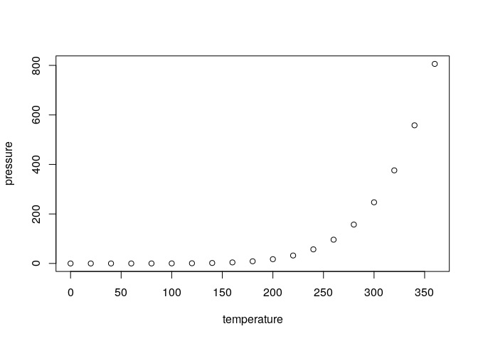

<!-- README.md is generated from README.Rmd. Please edit that file -->
spaceXstats
===========

[](https://cran.r-project.org/package=RspaceXstats) [](https://travis-ci.org/mwaldstein/RspaceXstats) [](https://ci.appveyor.com/project/mwaldstein/RspaceXstats) [](https://codecov.io/github/mwaldstein/RspaceXstats?branch=master)

-   Author/Maintainer: [Micah J Waldstein](https://micah.waldste.in)
-   License: [MIT](https://opensource.org/licenses/MIT)

The goal of spaceXstats is to ...

What is special about using `README.Rmd` instead of just `README.md`? You can include R chunks like so:

``` r
summary(cars)
#>      speed           dist       
#>  Min.   : 4.0   Min.   :  2.00  
#>  1st Qu.:12.0   1st Qu.: 26.00  
#>  Median :15.0   Median : 36.00  
#>  Mean   :15.4   Mean   : 42.98  
#>  3rd Qu.:19.0   3rd Qu.: 56.00  
#>  Max.   :25.0   Max.   :120.00
```

You can also embed plots, for example:



In that case, don't forget to commit and push the resulting figure files, so they display on GitHub!

Conduct
-------

Please note that this project is released with a [Contributor Code of Conduct](CONDUCT.md). By participating in this project you agree to abide by its terms.
